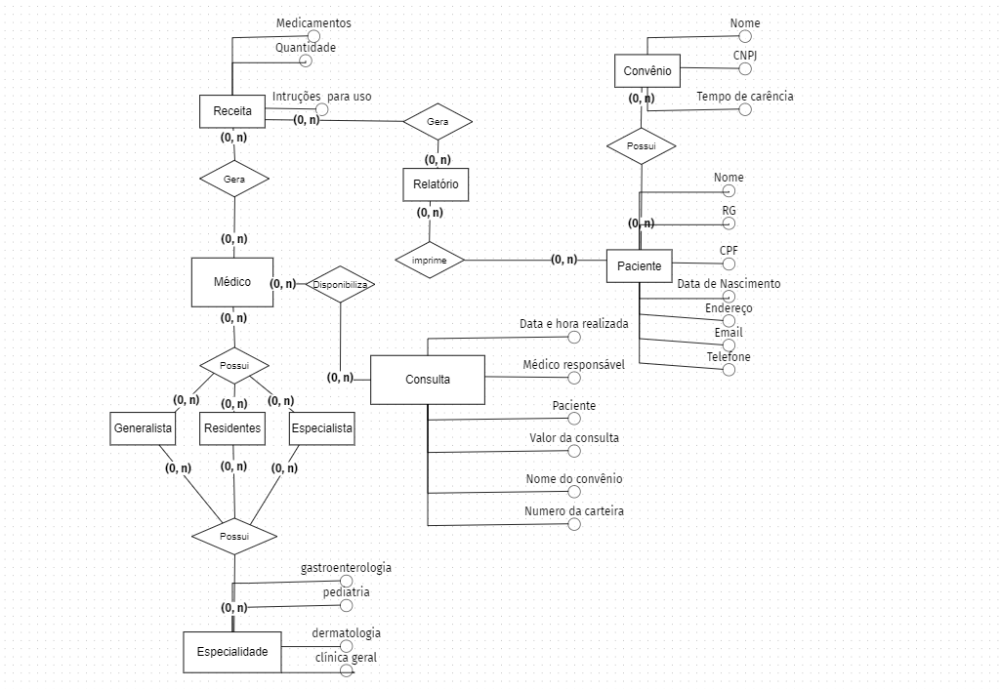
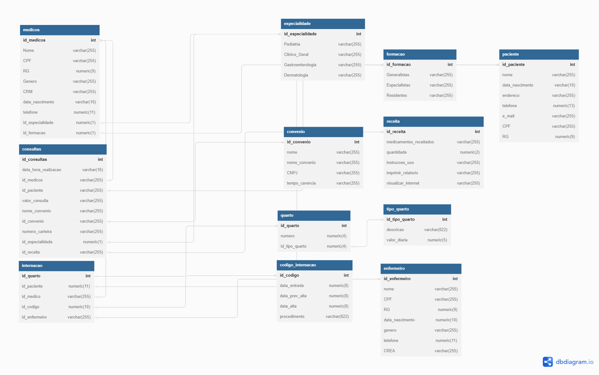

# Projeto de Banco de Dados 
Projeto com o objetivo de criar um banco de dados para um hospital, separando o mesmo em cinco etapas.
# O Hospital  Fundamental 
## Modelo Conceitual do Banco
Um pequeno hospital local busca desenvolver um novo sistema que atenda melhor às suas necessidades. Atualmente, parte da operação ainda se apoia em planilhas e arquivos antigos, mas espera-se que esses dados sejam transferidos para o novo sistema assim que ele estiver funcional. Neste momento, é necessário analisar com cuidado as necessidades desse cliente e sugerir uma estrutura de banco de dados adequada por meio de um Diagrama Entidade-Relacionamento.
Tendo isso em vista fiz um diagrama de relacionamento com os dados citados no exercício.

##
<h5>1.) O hospital necessita de um sistema para sua área clínica que ajude a controlar consultas realizadas. Os médicos podem ser generalistas, especialistas ou residentes e têm seus dados pessoais cadastrados em planilhas digitais. Cada médico pode ter uma ou mais especialidades, que podem ser pediatria, clínica geral, gastroenterologia e dermatologia. Alguns registros antigos ainda estão em formulário de papel, mas será necessário incluir esses dados no novo sistema.</h5>

<h5>2.) Os pacientes também precisam de cadastro, contendo dados pessoais (nome, data de nascimento, endereço, telefone e e-mail), documentos (CPF e RG) e convênio. Para cada convênio, são registrados nome, CNPJ e tempo de carência.</h5>

<h5>3.) As consultas também têm sido registradas em planilhas, com data e hora de realização, médico responsável, paciente, valor da consulta ou nome do convênio, com o número da carteira. Também é necessário indicar na consulta qual a especialidade buscada pelo paciente.</h5>

<h5>4.) Deseja-se ainda informatizar a receita do médico, de maneira que, no encerramento da consulta, ele possa registrar os medicamentos receitados, a quantidade e as instruções de uso. A partir disso, espera-se que o sistema imprima um relatório da receita ao paciente ou permita sua visualização via internet.</h5>

###### De acordo com essas informações esquematizei em forma de modelo conceitual.

##
<h1>Hospital Fundamental Parte II</h1>

No hospital, as internações têm sido registradas por meio de formulários eletrônicos que gravam os dados em arquivos.
 

Para cada internação, são anotadas a data de entrada, a data prevista de alta e a data efetiva de alta, além da descrição textual dos procedimentos a serem realizados.
 

As internações precisam ser vinculadas a quartos, com a numeração e o tipo.
 

Cada tipo de quarto tem sua descrição e o seu valor diário (a princípio, o hospital trabalha com apartamentos, quartos duplos e enfermaria).

Também é necessário controlar quais profissionais de enfermaria estarão responsáveis por acompanhar o paciente durante sua internação. Para cada enfermeiro(a), é necessário nome, CPF e registro no conselho de enfermagem (CRE).

A internação, obviamente, é vinculada a um paciente – que pode se internar mais de uma vez no hospital – e a um único médico responsável.

     
##
<h3>Mãos a obra?</h3>

Faça a ligação do diagrama acima ao diagrama desenvolvido na atividade antrior, construindo relacionamentos com entidades relacionadas. E eleve o seu diagrama para que já selecionando os tipos de dados que serão trabalhados e em quais situações.

## Segue a atualização e melhora do diagrama completo com todas sua ligações

##

Por último, crie um script SQL para a geração do banco de dados e para instruções de montagem de cada uma das entidades/tabelas presentes no diagrama completo (considerando as entidades do diagrama da atividade anterior e as novas entidades propostas no diagrama acima). Também crie tabelas para relacionamentos quando necessário. Aplique colunas e chaves primárias e estrangeiras.
 

Você pode utilizar o MySQL Workbench ou o DBdiagram.io para montar os scripts SQL.

Segue também o link para melhor visualização e navegação https://dbdiagram.io/d/64558d84dca9fb07c498d3d2

##
<h3>Parte Lógica segue</h3>

Table Medicos {
  <h6>Id numeric</h6>
  <h6>Nome varchar</h6>
  <h6>CPF numeric</h6>
  <h6>RG numeric</h6>
  <h6>Genero varchar</h6>
  <h6>CRM numeric</h6>
  <h6>Data_Nascimento numeric</h6>
  <h6>Telefone numeric</h6>
  <h6>Especialidade numeric</h6>
  <h6>Formacao numeric</h6>
}

Table Especialidade {
  <h6>Pediatria key(1)</h6>
  <h6>"Clinico Geral" key(2) </h6>
  <h6>Gastroenterologia key(3)</h6>
  <h6>Dermatologia key(4)</h6>
}

Table Formacao {
  <h6>Generalistas key(1)</h6>
  <h6>Especialistas key(2)</h6>
  <h6>Residentes key(3)</h6>
}

Table Paciente {
  <h6>Nome varchar</h6>
  <h6>Data_Nascimento numeric</h6>
  <h6>Endereco varchar</h6>
  <h6>Telefone numeric</h6>
  <h6>E_mail varchar</h6>
  <h6>CPF numeric</h6>
  <h6>RG numeric</h6>
}

Table Convenio {
  <h6>Nome varchar</h6>
  <h6>CNPJ numeric</h6>
  <h6>Tempo_Carencia varchar</h6>
}

Table Consultas {
  <h6>Data_Hora_Realizacao numeric</h6>
  <h6>Medico_Responsavel varchar</h6>
  <h6>Paciente varchar</h6>
  <h6>Valor_Consulta numeric</h6>
  <h6>Nome_Convenio varchar</h6>
  <h6>Numero_Carteira numeric</h6>
  <h6>Especialidade numeric</h6>
}

Table Receita {
  <h6>Medicamentos_Receitados varchar</h6>
  <h6>Quantidade numeric</h6>
  <h6>Instrucoes_Uso varchar</h6>
  <h6>Imprimir_Relatorio varchar</h6>
  <h6>Visualizar_Internet varchar</h6>
}

Table Internacao {
  <h6>Numero_Quarto numeric</h6>
  <h6>Cadastro_Paciente numeric</h6>
  <h6>Medico_Responsavel varchar</h6>
  <h6>Codigo_Internacao numeric</h6>
  <h6>Enfermeiro numeric</h6>
}

Table Enfermeiro {
  <h6>Id numeric</h6>
  <h6>Nome varchar</h6>
  <h6>CPF numeric</h6>
  <h6>RG numeric</h6>
  <h6>Data_Nascimento numeric</h6>
  <h6>Genero varchar</h6>
  <h6>Telefone numeric</h6>
  <h6>CRE numeric</h6>
}

Table Quarto {
  <h6>Id numeric</h6>
  <h6>Numero numeric</h6>
  <h6>Tipo_Quarto numeric</h6>
}

Table Tipo_Quarto {
  <h6>Id numeric</h6>
  <h6>Descricao varchar</h6>
  <h6>Valor_Diaria numeric</h6>
}

Table Codigo_Internacao {
  <h6>Id numeric</h6>
  <h6>Data_Entrada numeric</h6>
  <h6>Data_Prev_Alta numeric</h6>
  <h6>Data_Alta numeric</h6>
  <h6>Procedimento varchar</h6>
}
 

Ref: "Medicos"."Especialidade" < "Especialidade"."Pediatria"

Ref: "Medicos"."Especialidade" < "Especialidade"."Clinico Geral"

Ref: "Medicos"."Especialidade" < "Especialidade"."Gastroenterologia"

Ref: "Medicos"."Especialidade" < "Especialidade"."Dermatologia"

Ref: "Medicos"."Formacao" < "Formacao"."Generalistas"

Ref: "Medicos"."Formacao" < "Formacao"."Especialistas"

Ref: "Medicos"."Formacao" < "Formacao"."Residentes"

Ref: "Paciente"."Nome" < "Convenio"."Nome"

Ref: "Paciente"."Nome" < "Consultas"."Paciente"

Ref: "Medicos"."Nome" < "Consultas"."Medico_Responsavel"

Ref: "Convenio"."Nome" < "Consultas"."Nome_Convenio"

Ref: "Convenio"."Nome" < "Consultas"."Numero_Carteira"

Ref: "Consultas"."Especialidade" < "Especialidade"."Pediatria"

Ref: "Consultas"."Especialidade" < "Especialidade"."Clinico Geral"

Ref: "Consultas"."Especialidade" < "Especialidade"."Gastroenterologia"

Ref: "Consultas"."Especialidade" < "Especialidade"."Dermatologia"

Ref: "Receita"."Medicamentos_Receitados" < "Consultas"."Data_Hora_Realizacao"

Ref: "Internacao"."Cadastro_Paciente" < "Paciente"."Nome"

Ref: "Internacao"."Medico_Responsavel" < "Medicos"."Nome"

Ref: "Quarto"."Tipo_Quarto" < "Tipo_Quarto"."Id"

Ref: "Internacao"."Numero_Quarto" < "Quarto"."Numero"

Ref: "Internacao"."Codigo_Internacao" < "Codigo_Internacao"."Id"

Ref: "Internacao"."Enfermeiro" < "Enfermeiro"."Id"

##
<h1>Hospital Fundamental Parte III</h1>

Nesta parte foi criado o Banco de Dados no MySQL, com todas as referenciações e entidades necessárias

##
<h1>Hospital Fundamental Parte IV</h1>

Nesta etapa foi adicionada a coluna em_atividade e os elementos "Ativo" e "Inativo" para alguns medicos

##
<h1>As Relíquias dos Dados Parte V</h1>

Uma vez que o banco estiver bem estruturado e desenhado, é possível realizar testes, simulando relatórios ou telas que o sistema possa necessitar. A tarefa consiste em criar consultas que levem aos resultados esperados.

1.Todos os dados e o valor médio das consultas do ano de 2020 e das que foram feitas sob convênio.
 
<h6>Somente 4 consultas foram feitas em 2020</h6>
<h6>select * from consultas where data_hora_realizacao like "%2020%";</h6> 
<h6>O valor médio dessas consultas foi de R$329,45,/h6>
<h6>SELECT AVG (valor_consulta) as media from consultas;</h6>
  

2.Todos os dados das internações que tiveram data de alta maior que a data prevista para a alta.
 
<h6>No total foram 4 internações que tiveram data de alta maior que a data prevista para a alta.</h6>
<h6>select * from codigo_internacao where data_prev_alta < data_alta;</h6> 
<h6>Para ver quais foram os pacientes use esses scripts</h6>
<h6>select * from internacao where id_codigo = '1';</h6>
<h6>select * from internacao where id_codigo = '2';</h6>
<h6>select * from internacao where id_codigo = '5';</h6>
<h6>select * from internacao where id_codigo = '7';</h6>
    

3.Receituário completo da primeira consulta registrada com receituário associado.

<h6>Use o primeiro script para observar a primeira consulta realizada, e o segundo para verificar a receita.</h6>
<h6>select * from consultas;</h6>
<h6>select * from receita where id_receita = '#1234567890';</h6>
    

4.Todos os dados da consulta de maior valor e também da de menor valor (ambas as consultas não foram realizadas sob convênio).

<h6>Use esses scripts para verificar a consulta de maior valor</h6>
<h6>select max(valor_consulta) as maior_valor from consultas;</h6>
<h6>select * from consultas where valor_consulta = '736,23';</h6> 
<h6>Use esses scripts para verificar a consulta de menor valor</h6>
<h6>select min(valor_consulta) as menor_valor from consultas;</h6>
<h6>select * from consultas where valor_consulta = '123,90';</h6>
    

5.Todos os dados das internações em seus respectivos quartos, calculando o total da internação a partir do valor de diária do quarto e o número de dias entre a entrada e a alta.

<h6> O primeiro paciente ficou 9 dias internado no Apartamento, logo terá que pagar 230*9 = R$2.070,00</h6>
<h6>select * from internacao; | select * from quarto; | select * from tipo_quarto; | select * from codigo_internacao; | select datediff ('20150802','20150811');</h6> 
<h6>O segundo paciente ficou 38 dias internado no quarto duplo, logo terá que pagar 150*38 = R$ 5.700,00</h6>
<h6>select * from internacao; | select * from quarto; | select * from tipo_quarto; | select * from codigo_internacao; | select datediff ('20151017','20151124');</h6> 
<h6>o terceiro paciente ficou 50 dias internado na enfermaria, logo terá que pagar 100*50 = R$5.000,00</h6>
<h6>select * from internacao; | select * from quarto; | select * from tipo_quarto; | select * from codigo_internacao; | select datediff ('20160420','20160301');</h6> 
<h6>O quarto paciente ficou 12 dias internado no Apartamento, logo terá que pagar 230*12 = R$2.760,00</h6>
<h6>select * from internacao; | select * from quarto; | select * from tipo_quarto; | select * from codigo_internacao; | select datediff ('20170621','20170609');</h6> 
<h6>O quinto paciente ficou 40 dias internado no quarto duplo, logo terpa que pagar 150*40 = R$6.000,00</h6>
<h6>select * from internacao; | select * from quarto; | select * from tipo_quarto; | select * from codigo_internacao; | select datediff ('20180119','20180228');</h6> 
<h6>O sexto paciente ficou 16 dias internado na enfermaria, logo terá que pagar 100*16 = R$1.600,00</h6>
<h6>select * from internacao; | select * from quarto; | select * from tipo_quarto; | select * from codigo_internacao; | select datediff ('20191008','20191024');</h6> 
<h6>O setimo paciente ficou 31 dias internado no apartamento, logo terá que pagar 150*31 = R$4.650,00</h6>
<h6>select * from internacao; | select * from quarto; | select * from tipo_quarto; | select * from codigo_internacao; | select datediff ('20220415','20220516');</h6> 
  

6.Data, procedimento e número de quarto de internações em quartos do tipo “apartamento”.

<h6>Somente 3 pessoas ficaram internadas no Apartamento, para verificar todas essas informações, use os scripts abaixo</h6>
<h6>select * from internacao;</h6>
<h6>select data_entrada, data_alta, procedimento from codigo_internacao;</h6>
<h6>select * from quarto where id_tipo_quarto = 1;</h6>
  

7.Nome do paciente, data da consulta e especialidade de todas as consultas em que os pacientes eram menores de 18 anos na data da consulta e cuja especialidade não seja “pediatria”, ordenando por data de realização da consulta.

<h6>Somente o paciente João da Silva, é menor de idade e não passou com Pediatra</h6>
<h6>select * from consultas;</h6>
<h6>select * from paciente;</h6>
  

8.Nome do paciente, nome do médico, data da internação e procedimentos das internações realizadas por médicos da especialidade “gastroenterologia”, que tenham acontecido em “enfermaria”.
<h6>Somente o paciente Rodrigo Almeida que foi atendido pela Doutora Laura Santos entra nos parâmetros pedidos acima</h6>
<h6>select * from medicos where id_formacao = 2;</h6>
<h6>select * from internacao where id_medicos = 8;</h6>
<h6>select * from quarto;</h6>
<h6>select * from paciente</h6>
  

9.Os nomes dos médicos, seus CRMs e a quantidade de consultas que cada um realizou.

<h6>Segue as respostas de cada medico</h6>
<h6>Sara Pereira Almeida realizou 2 consultas</h6>
<h6>Beatriz Lima realizou 2 consultas</h6>
<h6>Maria Oliveira realizou 2 consultas</h6>
<h6>Juliana Silva realizou 3 consultas</h6>
<h6>Lucas Souza realizou 2 consultas</h6>
<h6>Camila Oliveira realizou 2 consultas</h6>
<h6>Pedro Alves realizou 1 consulta</h6>
<h6>Mariana Costa realizou 8 consultas</h6>
<h6>Laura Santos realizou 2 consultas</h6>
<h6>Gabriel Augusto realizou 2 consultas</h6> 
<h6>Scripts usados select id_medicos from consultas where id_medicos = ; | select nome from medicos;</h6>
      

10.Todos os médicos que tenham "Gabriel" no nome.

<h6>Somente um medico possui "Gabriel" no nome</h6>
<h6>select * from medicos where nome like '%Gabriel%';</h6>
  

11.Os nomes, CREs e número de internações de enfermeiros que participaram de mais de uma internação.

<h6>Os enfermeiros Guilherme Camargo, Lucas Mendes, Pedro Oliveira Gabriela Silva participaram de mais de uma internação</h6>
<h6>select * from internacao;</h6>
<h6>select * from enfermeiro;</h6>

